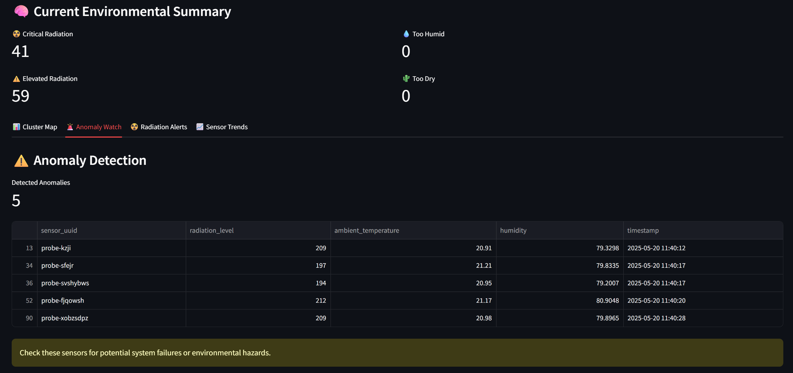
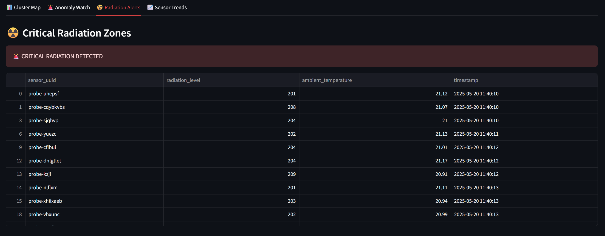
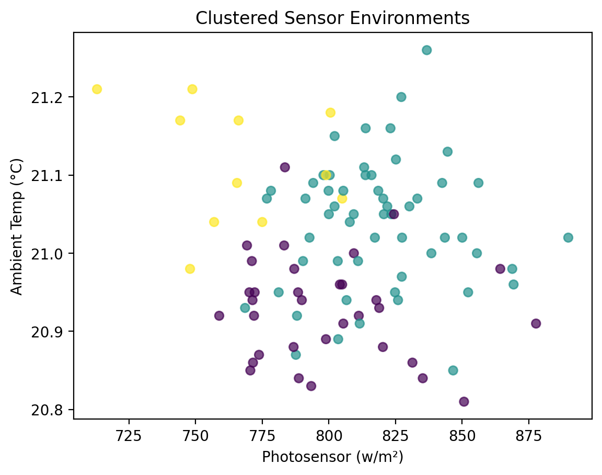
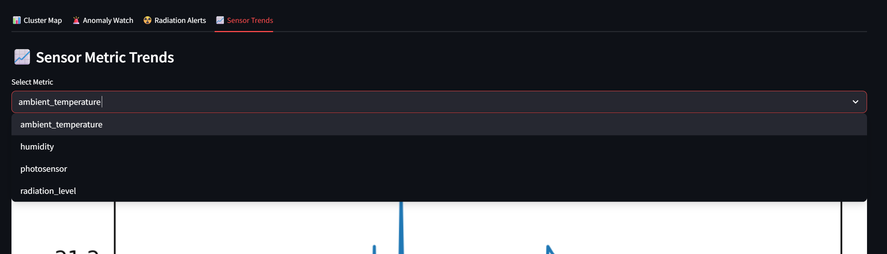

# 🛰️ Cowabunga Command Center

**Smart Bunker Environmental Monitoring System**

This project simulates a real-time sensor network designed for high-end survival bunkers or remote environmental monitoring. Using live data streamed from PubNub, the system ingests readings like radiation, temperature, humidity, and light levels. Machine learning algorithms are applied to detect unusual activity and classify sensor zones, with insights displayed in a tactical dashboard built using Streamlit.

---

## 📦 Features

- ✅ Real-time data ingestion from PubNub sensor network
- ✅ KMeans clustering for zone detection
- ✅ Isolation Forest anomaly detection (e.g., radiation spikes)
- ✅ Environmental alert flags (☢️ Radiation, 💧 Humidity)
- ✅ Tactical-themed Streamlit dashboard with multiple views

---

## 🚀 How to Run

### Step 1: Install dependencies

```bash
pip install -r requirements.txt
```

### Step 2: Ingest and analyze data

```bash
python streaming_ml_project.py
python sensor_analysis.py
```

### Step 3: Launch the dashboard

```bash
streamlit run cowabunga_command_center.py
```

> You can also explore the data outputs in `sensor_anomalies.csv` and `clustered_sensor_data.csv`.

---

## 📂 Project Structure

| File | Purpose |
|------|---------|
| `streaming_ml_project.py` | Ingests 100 live records from PubNub |
| `sensor_analysis.py` | Runs clustering + anomaly detection and adds alert flags |
| `cowabunga_command_center.py` | Interactive Streamlit dashboard |
| `cowabunga_sensor_data.csv` | Raw collected data |
| `sensor_anomalies.csv` | Data with anomaly + alert labels |
| `clustered_sensor_data.csv` | Data grouped by environment clusters |
| `screenshots/` | Example outputs and visual proof of functionality |

---

## 💡 Use Case

This system was designed as a prototype for **Cowabunga Cloud Solutions**, aimed at high-net-worth individuals building smart underground bunkers or off-grid survival systems. It could also be adapted for:

- Server room monitoring
- Agricultural environments
- Remote sensing for research labs
- Industrial IoT applications

---

## 📸 Screenshots

---

## 📸 Dashboard Previews

### 🛰️ Main Dashboard


### ⚠️ Anomaly Watch


### ☢️ Radiation Alerts


### 🧬 Sensor Clustering


### 📈 Metric Trends Over Time


---

## 🧠 Built With

- [Python](https://www.python.org/)
- [Streamlit](https://streamlit.io/)
- [Scikit-learn](https://scikit-learn.org/)
- [PubNub](https://www.pubnub.com/)
- [Pandas](https://pandas.pydata.org/)
- [Seaborn](https://seaborn.pydata.org/)
- [Matplotlib](https://matplotlib.org/)

---

## 📄 License

This project is licensed under the MIT License. Do whatever you want with it — just don’t blame us if your bunker blows up.

---

## 🤘 Author

**Justin Poehls**  
Founder @ [Cowabunga Cloud Solutions](https://cowabungacloud.com)  
Dreaming of off-grid data, pizza-powered platforms, and building tools that actually make life better.
